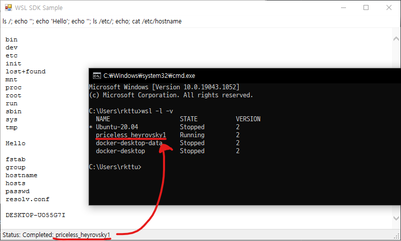

# Out-of-process COM server style WSL SDK

[한국어 버전의 README는 이곳에서 읽으실 수 있습니다.](README.ko-kr.md)

[](https://github.com/wslhub/wsl-sdk-com/actions/workflows/wsl-sdk-com-build.yml)



This project contains the out-of-process style COM server-based WSL APIs, which overcome the CoInitializeSecurity issues and still maintain ease of code management with the .NET Framework.

You can use this OOP-style COM server to query and run WSL commands via the Windows PowerShell, LINQPad, and all COM-supported clients. Once registered, every time you call the COM interface, the executable file automatically called and launched on-demand. If the reference count reaches zero, the process is automatically closed.

## How to build and test

1. You can start building this project with the .NET Framework SDK v4.0 or higher and the Windows 10, at least 1903 or higher release.
1. Build a release of the WslSdk project, and register the OOP COM server via elevated permission with the `Install.cmd` batch file.
1. You can run the unit test from now on or run the sample PowerShell script to test.
   ```powershell
   $ErrorActionPreference = "Stop"
   $obj = New-Object -ComObject 'WslSdk.WslService'

   Write-Output 'A WslSdk.WslService object is created'

   # Distro Register Check
   $distroName = 'Ubuntu-20.04'
   Write-Output $obj.IsDistroRegistered($distroName)

   # Metadata Query
   $o = $obj.GetDefaultDistro()
   Write-Output "Distro ID: $($o.DistroId())"
   Write-Output "Distro Name: $($o.DistroName())"

   $list = $obj.GetDistroList()
   Write-Output $list

   # Run WSL command
   $res = $obj.RunWslCommand($o.DistroName(), "cat /etc/os-release")
   Write-Output $res

   $obj = $null
   ```
1. If you uninstall the OOP COM server, call the `Uninstall.cmd` batch file via the elevated permission.

## Code Samples

- [Excel and Visual Basic for Application](sample/Excel/WslSdkSample.xlsb)
- [Jupyter Notebook and Python 3.x](sample/JupyterNotebook/Sample.ipynb)
- [Windows PowerShell 5.x](sample/PowerShell/Sample.ps1)
- [LINQPAD 5](sample/LinqPad5/)
- [.NET Framework 4.5](sample/NetFx4/)

## Some caveats

- Due to the lack of official WSL COM interface specification, I currently made this SDK with the limited WSL Win32 APIs.
- Due to the lack of a full COM integration feature, I do not choose the .NET Core and .NET 5+ to develop this SDK. Currently, .NET Core and .NET 5+ makes it very complicated to build an OOP COM server. However, if there are any improvements, I'll try migrating to .NET Core or .NET 5+ runtime.
- I tried to make this OOP COM server a registration-free module but failed. If anyone contributes to this enhancement, it makes even more flexibility to use this SDK.

## Things-to-do

- Make v1 COM Interface documentation
- Add ARM64 Support

## Open Source License Information

This project uses the MIT license. Please refer [LICENSE.txt](LICENSE.txt).
